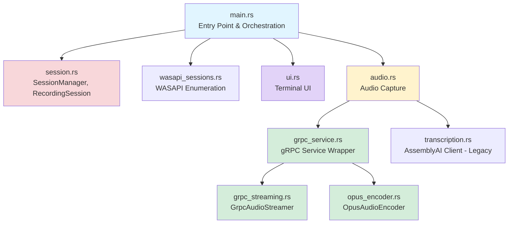
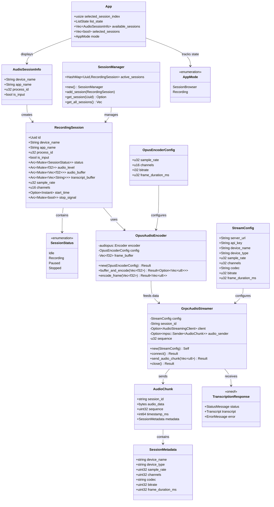
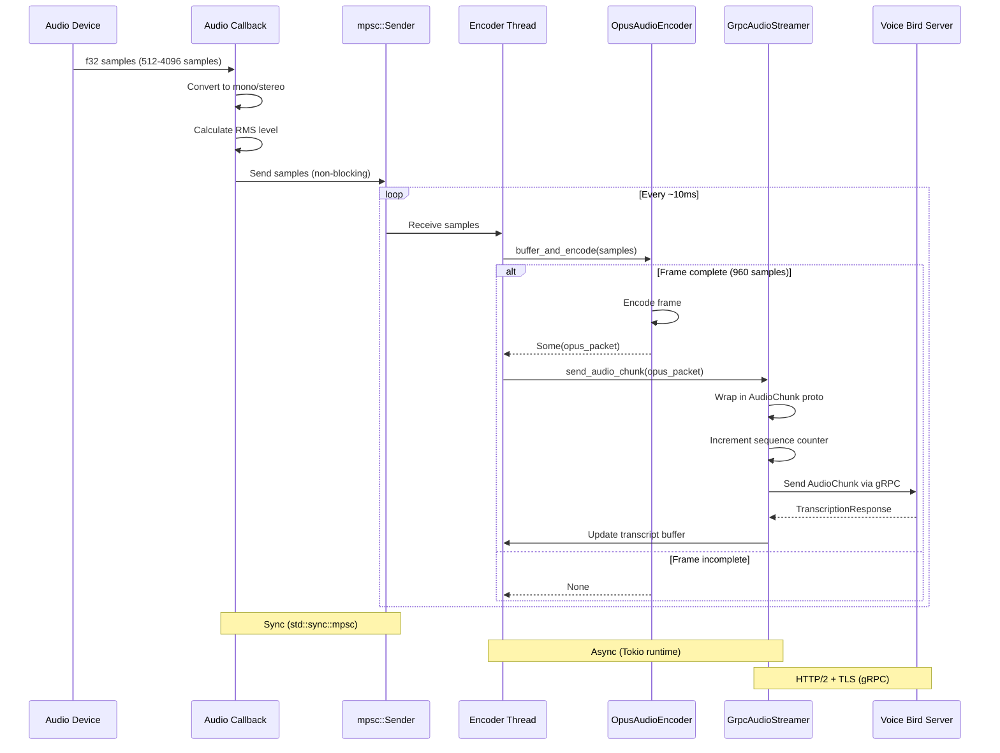
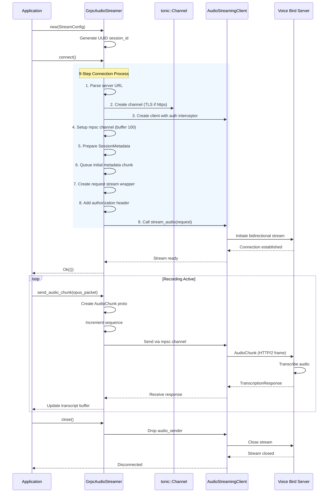
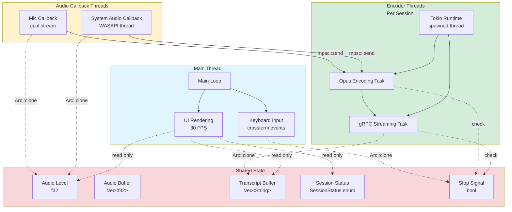

# Voice Bird Desktop - Dependency & Architecture Documentation

> Comprehensive cross-dependency mapping with mermaid diagrams and object descriptions

## Table of Contents

1. [Overview](#overview)
2. [Module Dependency Graph](#module-dependency-graph)
3. [Data Flow Architecture](#data-flow-architecture)
4. [Type & Struct Relationships](#type--struct-relationships)
5. [External Dependencies](#external-dependencies)
6. [Audio Processing Pipeline](#audio-processing-pipeline)
7. [gRPC Communication Flow](#grpc-communication-flow)
8. [Thread Architecture](#thread-architecture)
9. [Session Lifecycle](#session-lifecycle)
10. [Object Reference](#object-reference)

---

## Overview

**Voice Bird Desktop** is a Rust-based real-time audio recording and transcription application for Windows. It captures audio from multiple sources simultaneously (microphones and system audio via WASAPI loopback), streams it to a remote server via gRPC using Opus compression, and provides a terminal-based UI for managing recording sessions.

### Key Technologies
- **Language**: Rust (async/sync hybrid)
- **Audio**: cpal (input), WASAPI (output), Opus codec
- **Networking**: gRPC (Tonic), Protocol Buffers
- **UI**: ratatui (terminal-based)
- **Platform**: Windows-focused (with Linux/macOS input support)

---

## Module Dependency Graph



### Module Descriptions

| Module | Purpose | Key Exports |
|--------|---------|-------------|
| **main.rs** | Application entry point, orchestrates session management, recording lifecycle, and UI rendering | `main()`, session initialization |
| **session.rs** | Recording session data structures and state management | `SessionManager`, `RecordingSession`, `AudioSessionInfo`, `SessionStatus` |
| **wasapi_sessions.rs** | Windows WASAPI audio session enumeration using COM APIs | `enumerate_audio_sessions()` |
| **ui.rs** | Terminal UI using ratatui (session browser, recording dashboard) | `App`, `AppMode`, `render_*` functions |
| **audio.rs** | Audio device capture (cpal for input, WASAPI for output loopback) | `start_input_recording()`, `start_output_recording()` |
| **grpc_service.rs** | High-level wrapper for gRPC streaming service | `GrpcStreamingService::stream_to_server()` |
| **grpc_streaming.rs** | Low-level gRPC bidirectional streaming client | `GrpcAudioStreamer` |
| **opus_encoder.rs** | Opus audio codec encoder with buffering | `OpusAudioEncoder` |
| **transcription.rs** | Legacy AssemblyAI WebSocket client (not actively used) | `TranscriptionClient` |

---

## Data Flow Architecture

```mermaid
flowchart LR
    subgraph Input["Audio Input Sources"]
        mic[Microphone<br/>cpal]
        sys[System Audio<br/>WASAPI Loopback]
    end

    subgraph Capture["Audio Capture"]
        callback[Audio Callback<br/>f32 samples]
    end

    subgraph Processing["Audio Processing"]
        buffer[Sample Buffer]
        opus_enc[Opus Encoder<br/>960 samples/frame]
        packets[Opus Packets<br/>u8 bytes]
    end

    subgraph Network["Network Streaming"]
        grpc[gRPC Client<br/>Tonic]
        proto[Protocol Buffers<br/>AudioChunk]
    end

    subgraph Server["Remote Server"]
        server[Voice Bird Server<br/>Transcription Service]
    end

    subgraph UI["User Interface"]
        display[Terminal UI<br/>ratatui]
        levels[Audio Levels]
        transcripts[Transcripts]
    end

    mic --> callback
    sys --> callback
    callback -->|mpsc channel| buffer
    buffer --> opus_enc
    opus_enc -->|20ms frames| packets
    packets --> grpc
    grpc -->|protobuf| proto
    proto -->|TLS/HTTP2| server
    server -->|bidirectional| transcripts

    callback -.->|Arc Mutex| levels
    transcripts -.->|Arc Mutex| display
    levels --> display

    style Input fill:#e1f5ff
    style Processing fill:#fff3cd
    style Network fill:#d4edda
    style Server fill:#f8d7da
    style UI fill:#e2d3f8
```



### Data Flow Stages

1. **Audio Capture**: Input devices (cpal) or system audio (WASAPI) → f32 PCM samples
2. **Buffering**: Callback thread sends samples via mpsc channel to encoder
3. **Encoding**: Opus encoder accumulates 960 samples (20ms @ 48kHz) → compressed packets
4. **Serialization**: Opus packets wrapped in protobuf `AudioChunk` messages
5. **Streaming**: gRPC bidirectional stream over HTTP/2 (with TLS)
6. **Server Processing**: Remote server transcribes audio and sends back `TranscriptionResponse`
7. **UI Update**: Transcripts and audio levels displayed in real-time terminal UI

---

## Type & Struct Relationships



---

## External Dependencies

```mermaid
graph TB
    subgraph Audio["Audio Processing"]
        cpal[cpal 0.15<br/>Cross-platform Audio I/O]
        audiopus[audiopus 0.3<br/>Opus Codec Bindings]
        hound[hound 3.5<br/>WAV File I/O]
    end

    subgraph gRPC["gRPC & Protobuf"]
        tonic[tonic 0.11<br/>gRPC Framework]
        prost[prost 0.12<br/>Protocol Buffers]
        tonic_build[tonic-build 0.11<br/>Codegen - Build Time]
        tokio_stream[tokio-stream 0.1<br/>Stream Utilities]
    end

    subgraph Async["Async Runtime"]
        tokio[tokio 1.0<br/>Async Runtime - Full]
        futures[futures-util 0.3<br/>Future Combinators]
    end

    subgraph Network["Networking - Legacy"]
        tungstenite[tokio-tungstenite 0.23<br/>WebSocket Client]
        http[http 1.0<br/>HTTP Types]
    end

    subgraph UI["Terminal UI"]
        ratatui[ratatui 0.29<br/>Terminal UI Framework]
        crossterm[crossterm 0.27<br/>Terminal Manipulation]
        console[console 0.15<br/>Styled Output]
        dialoguer[dialoguer 0.11<br/>Interactive Prompts]
    end

    subgraph Utils["Utilities"]
        anyhow[anyhow 1.0<br/>Error Handling]
        chrono[chrono 0.4<br/>Date/Time]
        uuid[uuid 1.0<br/>UUID Generation]
        serde[serde 1.0<br/>Serialization]
        serde_json[serde_json 1.0<br/>JSON Support]
        base64[base64 0.22<br/>Base64 Encoding]
        dotenvy[dotenvy 0.15<br/>.env File Loading]
    end

    subgraph Windows["Windows-Specific"]
        windows[windows 0.58<br/>Win32 API Bindings]
        windows_core[windows-core 0.58<br/>Core Windows Types]
    end

    App[Voice Bird Desktop]

    App --> cpal
    App --> audiopus
    App --> hound
    App --> tonic
    App --> prost
    App --> tokio
    App --> futures
    App --> ratatui
    App --> crossterm
    App --> anyhow
    App --> chrono
    App --> uuid
    App --> windows

    tonic --> tokio
    tonic --> prost
    tonic --> tokio_stream

    style Audio fill:#e1f5ff
    style gRPC fill:#d4edda
    style Async fill:#fff3cd
    style Network fill:#ddd
    style UI fill:#e2d3f8
    style Utils fill:#f8f9fa
    style Windows fill:#f8d7da
```



### External Dependency Details

| Crate | Version | Purpose | Key Features Used |
|-------|---------|---------|-------------------|
| **cpal** | 0.15 | Cross-platform audio I/O | Input device enumeration, stream building, sample format conversion |
| **audiopus** | 0.3 | Opus codec bindings | VOIP mode, complexity 5, FEC, 48kHz encoding |
| **hound** | 3.5 | WAV file encoding/decoding | Write f32 PCM samples to disk |
| **tonic** | 0.11 | gRPC framework | Bidirectional streaming, TLS support, metadata headers |
| **prost** | 0.12 | Protocol Buffers | Message serialization/deserialization |
| **tonic-build** | 0.11 | Protobuf code generation | Build-time proto compilation (client-only) |
| **tokio** | 1.0 | Async runtime | Full features: macros, rt-multi-thread, fs, sync, time |
| **tokio-stream** | 0.1 | Stream utilities | Wrappers for gRPC streams |
| **futures-util** | 0.3 | Future combinators | Stream extensions, async utilities |
| **tokio-tungstenite** | 0.23 | WebSocket client (legacy) | Native-tls, no default compression |
| **ratatui** | 0.29 | Terminal UI framework | Widgets: List, Gauge, Paragraph, Block |
| **crossterm** | 0.27 | Terminal manipulation | Event handling, raw mode, screen clearing |
| **anyhow** | 1.0 | Error handling | Context trait, error propagation |
| **chrono** | 0.4 | Date/time | Timestamp generation, duration formatting |
| **uuid** | 1.0 | UUID generation | v4 random UUIDs for session IDs |
| **serde** | 1.0 | Serialization framework | Derive macros for structs |
| **serde_json** | 1.0 | JSON support | Environment config, debugging |
| **base64** | 0.22 | Base64 encoding | Audio data encoding (legacy) |
| **dotenvy** | 0.15 | .env file loading | Load SERVER_URL, API_KEY from environment |
| **windows** | 0.58 | Win32 API bindings | WASAPI, COM, Process APIs - see feature list below |
| **windows-core** | 0.58 | Core Windows types | HRESULT, GUID, PCWSTR |

### Windows Features Used

The `windows` crate requires extensive feature flags for WASAPI and COM operations:

- `Win32_Media_Audio` - Core WASAPI audio APIs (IAudioClient, IAudioCaptureClient)
- `Win32_Media_Multimedia` - Multimedia device management
- `Win32_System_Com` - COM infrastructure (CoInitializeEx, CoCreateInstance)
- `Win32_System_Com_StructuredStorage` - Property storage (IPropertyStore)
- `Win32_System_Threading` - Process/thread APIs (OpenProcess, GetCurrentThreadId)
- `Win32_Foundation` - Core Windows types (HWND, BOOL, PWSTR)
- `Win32_System_ProcessStatus` - Process information (K32GetModuleFileNameExW)
- `Win32_UI_Shell_PropertiesSystem` - Device properties (PKEY_Device_FriendlyName)
- `Win32_Devices_FunctionDiscovery` - Device enumeration (IMMDeviceEnumerator)

---

## Audio Processing Pipeline



### Pipeline Stages

#### 1. Audio Capture
- **Input Source**: Microphone (cpal) or System Audio (WASAPI loopback)
- **Sample Format**: F32, I16, or U16 → normalized to f32 [-1.0, 1.0]
- **Channel Conversion**:
  - Mono: Direct passthrough
  - Stereo: Average L+R channels → mono
- **Callback Size**: Variable (typically 512-4096 samples per callback)

#### 2. Level Calculation
```rust
// RMS (Root Mean Square) calculation
let sum_squares: f32 = samples.iter().map(|s| s * s).sum();
let rms = (sum_squares / samples.len() as f32).sqrt();
```
- Stored in `Arc<Mutex<f32>>` for UI display
- Color-coded in UI: Green (0-0.5), Yellow (0.5-0.75), Red (0.75+)

#### 3. Sample Buffering
- **Channel Type**: `std::sync::mpsc::Sender<Vec<f32>>`
- **Flow**: Audio callback (sync) → Encoder thread (async Tokio runtime)
- **Buffer Size**: Unbounded (samples accumulate until consumed)

#### 4. Opus Encoding
- **Frame Size**: 960 samples (20ms @ 48kHz)
- **Encoder Config**:
  - Sample Rate: 48000 Hz
  - Channels: 1 (mono)
  - Bitrate: 24000 bps
  - Application: VOIP (speech optimized)
  - Complexity: 5 (medium CPU)
  - FEC: Enabled (5% packet loss tolerance)
- **Buffering Logic**: Accumulates samples until 960 available, then encodes
- **Output**: Variable-size compressed packets (~60 bytes per 20ms)

#### 5. gRPC Streaming
- **Message Type**: `AudioChunk` protobuf
- **Fields**:
  - `session_id`: UUID string
  - `audio_data`: Opus packet bytes
  - `sequence`: Incrementing counter (detects packet loss)
  - `timestamp_ms`: Unix timestamp
  - `metadata`: Sent only on first packet (device info, codec params)
- **Protocol**: HTTP/2 bidirectional streaming
- **TLS**: Automatic based on URL scheme (https://)
- **Channel Buffer**: 100 messages (backpressure handling)

#### 6. Server Response
- **Message Type**: `TranscriptionResponse` protobuf
- **Response Types**:
  - `StatusMessage`: Connection status, session info
  - `Transcript`: Text, confidence, is_final flag, timestamps
  - `ErrorMessage`: Error details
- **Update Flow**: Response → `Arc<Mutex<Vec<String>>>` → UI display

---

## gRPC Communication Flow



### gRPC Configuration Details

#### Connection Endpoint
```rust
let endpoint = Channel::from_shared(config.server_url.clone())?
    .timeout(Duration::from_secs(30))
    .tcp_keepalive(Some(Duration::from_secs(60)));

// TLS detection
let channel = if config.server_url.starts_with("https://") {
    endpoint
        .tls_config(ClientTlsConfig::new())?
        .connect()
        .await?
} else {
    endpoint.connect().await?
};
```

#### Authentication
```rust
// Metadata interceptor adds authorization header
let mut request = Request::new(stream);
request.metadata_mut().insert(
    "authorization",
    MetadataValue::from_str(&self.config.api_key)?
);
```

#### Initial Metadata Packet
Sent as first `AudioChunk` to inform server of session parameters:
```protobuf
message AudioChunk {
  string session_id = 1;           // UUID
  bytes audio_data = 2;            // Empty for metadata packet
  uint32 sequence = 3;             // 0 for metadata packet
  int64 timestamp_ms = 4;
  SessionMetadata metadata = 5;    // Only sent once
}

message SessionMetadata {
  string device_name = 1;          // e.g., "Microphone (USB)"
  string device_type = 2;          // "input" or "output"
  uint32 sample_rate = 3;          // 48000
  uint32 channels = 4;             // 1
  string codec = 5;                // "opus"
  uint32 bitrate = 6;              // 24000
  uint32 frame_duration_ms = 7;    // 20
}
```

#### Error Handling
- Connection timeout: 30 seconds
- TCP keepalive: 60 seconds
- Retry logic: None (manual reconnect required)
- Error propagation: `anyhow::Error` with context

---

## Thread Architecture



### Thread Communication Patterns

#### 1. Audio Callback → Encoder Thread
```rust
// Sync channel (std::sync::mpsc)
let (tx, rx) = mpsc::channel::<Vec<f32>>();

// In audio callback (high-priority audio thread)
tx.send(samples.clone()).ok();

// In encoder thread
while let Ok(samples) = rx.recv() {
    // Process samples
}
```

#### 2. Encoder Thread → gRPC Task
```rust
// Async channel (tokio::sync::mpsc)
let (tx, mut rx) = tokio::sync::mpsc::channel::<AudioChunk>(100);

// In encoder task
tx.send(audio_chunk).await?;

// In gRPC streaming task
while let Some(chunk) = rx.recv().await {
    // Send to server
}
```

#### 3. Shared State Access
```rust
// Write audio level (from callback thread)
let mut level = session.audio_level.lock().unwrap();
*level = calculate_rms(&samples);
drop(level); // Release lock immediately

// Read audio level (from UI thread)
let level = session.audio_level.lock().unwrap();
let gauge_value = *level;
```

#### 4. Stop Signal
```rust
// Main thread sets stop signal
let mut stop = session.stop_signal.lock().unwrap();
*stop = true;

// Encoder thread checks stop signal
loop {
    let stop = session.stop_signal.lock().unwrap();
    if *stop {
        break;
    }
    // Continue processing...
}
```

### Thread Safety Guarantees

| Pattern | Mechanism | Purpose |
|---------|-----------|---------|
| **Audio Level** | `Arc<Mutex<f32>>` | Atomic updates from callback, read from UI |
| **Audio Buffer** | `Arc<Mutex<Vec<f32>>>` | Accumulates all recorded samples (WAV export) |
| **Transcript Buffer** | `Arc<Mutex<Vec<String>>>` | Stores transcription segments from server |
| **Session Status** | `Arc<Mutex<SessionStatus>>` | Tracks recording state (Idle, Recording, Paused, Stopped) |
| **Stop Signal** | `Arc<Mutex<bool>>` | Graceful shutdown coordination across threads |
| **Sample Channel** | `std::sync::mpsc` | Lock-free audio callback → encoder |
| **gRPC Channel** | `tokio::sync::mpsc` | Backpressure-aware encoder → network |

### COM Thread Safety (Windows)

WASAPI operations require strict COM threading model:

```rust
// Each WASAPI loopback thread initializes COM
unsafe {
    CoInitializeEx(None, COINIT_MULTITHREADED)?;
}

// All COM operations within this thread
let enumerator = create_device_enumerator()?;
let device = get_default_device(&enumerator)?;
// ... WASAPI operations ...

// Cleanup before thread exit
unsafe {
    CoUninitialize();
}
```

**Rules**:
- One `CoInitializeEx` per thread
- Matched `CoUninitialize` before thread exit
- No COM object sharing across threads
- All COM calls within same thread context

---

## Session Lifecycle

```mermaid
stateDiagram-v2
    [*] --> Idle: RecordingSession::new()

    Idle --> Recording: start_recording()
    Recording --> Recording: Audio streaming active
    Recording --> Paused: pause_recording()
    Recording --> Stopped: stop_recording()

    Paused --> Recording: resume_recording()
    Paused --> Stopped: stop_recording()

    Stopped --> [*]: Session cleanup

    note right of Idle
        Session created but not started
        - Audio device enumerated
        - gRPC streamer initialized
        - Threads not spawned
    end note

    note right of Recording
        Active audio capture
        - Audio callback running
        - Opus encoder processing
        - gRPC stream open
        - UI displays live levels
    end note

    note right of Paused
        Temporary pause (not implemented)
        - Audio callback paused
        - gRPC stream kept alive
        - Can resume quickly
    end note

    note right of Stopped
        Recording complete
        - Audio callback stopped
        - gRPC stream closed
        - WAV file saved
        - Transcript saved
    end note
```

### State Transitions

#### Session Creation (Idle)
```rust
let session = RecordingSession {
    id: Uuid::new_v4(),
    device_name: info.device_name.clone(),
    app_name: info.app_name.clone(),
    process_id: info.process_id,
    is_input: info.is_input,
    status: Arc::new(Mutex::new(SessionStatus::Idle)),
    audio_level: Arc::new(Mutex::new(0.0)),
    audio_buffer: Arc::new(Mutex::new(Vec::new())),
    transcript_buffer: Arc::new(Mutex::new(Vec::new())),
    sample_rate: 48000,
    channels: 1,
    start_time: None,
    stop_signal: Arc::new(Mutex::new(false)),
};
```

#### Start Recording
```rust
// Update status
let mut status = session.status.lock().unwrap();
*status = SessionStatus::Recording;
drop(status);

// Record start time
session.start_time = Some(Instant::now());

// Spawn audio capture thread
if session.is_input {
    start_input_recording(&session)?;
} else {
    start_output_recording(&session)?; // Windows only
}
```

#### Stop Recording
```rust
// Set stop signal (threads will exit)
let mut stop = session.stop_signal.lock().unwrap();
*stop = true;
drop(stop);

// Wait for threads to finish
thread::sleep(Duration::from_millis(500));

// Update status
let mut status = session.status.lock().unwrap();
*status = SessionStatus::Stopped;

// Save WAV file
let audio_buffer = session.audio_buffer.lock().unwrap();
save_wav_file(&session.id, &audio_buffer, session.sample_rate)?;

// Save transcript
let transcript_buffer = session.transcript_buffer.lock().unwrap();
save_transcript_file(&session.id, &transcript_buffer)?;
```

### Session Management

```rust
impl SessionManager {
    pub fn new() -> Self {
        Self {
            active_sessions: HashMap::new(),
        }
    }

    pub fn add_session(&mut self, session: RecordingSession) {
        self.active_sessions.insert(session.id, session);
    }

    pub fn get_session(&self, id: &Uuid) -> Option<&RecordingSession> {
        self.active_sessions.get(id)
    }

    pub fn get_all_sessions(&self) -> Vec<&RecordingSession> {
        self.active_sessions.values().collect()
    }

    pub fn remove_session(&mut self, id: &Uuid) -> Option<RecordingSession> {
        self.active_sessions.remove(id)
    }
}
```

---

## Object Reference

### Core Data Types

#### AudioSessionInfo
```rust
#[derive(Clone, Debug)]
pub struct AudioSessionInfo {
    pub device_name: String,    // Device name (e.g., "Microphone (USB)")
    pub app_name: String,        // Application name (e.g., "chrome.exe")
    pub process_id: u32,         // Windows process ID
    pub is_input: bool,          // true = microphone, false = speaker/loopback
}
```
**Purpose**: Represents an available audio source discovered during enumeration
**Created by**: `wasapi_sessions::enumerate_audio_sessions()` (Windows) or cpal device enumeration
**Used by**: Session browser UI, session creation

---

#### RecordingSession
```rust
pub struct RecordingSession {
    pub id: Uuid,                                      // Unique session identifier
    pub device_name: String,                           // Copy from AudioSessionInfo
    pub app_name: String,                              // Copy from AudioSessionInfo
    pub process_id: u32,                               // Copy from AudioSessionInfo
    pub is_input: bool,                                // Copy from AudioSessionInfo
    pub status: Arc<Mutex<SessionStatus>>,             // Current recording state
    pub audio_level: Arc<Mutex<f32>>,                  // Real-time RMS level [0.0, 1.0]
    pub audio_buffer: Arc<Mutex<Vec<f32>>>,            // All captured samples (for WAV export)
    pub transcript_buffer: Arc<Mutex<Vec<String>>>,    // Transcription segments from server
    pub sample_rate: u32,                              // Audio sample rate (typically 48000)
    pub channels: u16,                                 // Number of channels (1 = mono, 2 = stereo)
    pub start_time: Option<Instant>,                   // Recording start timestamp
    pub stop_signal: Arc<Mutex<bool>>,                 // Flag to stop all threads
}
```
**Purpose**: Manages a single active recording session (one device/app)
**Lifecycle**: Created when user starts recording, destroyed when stopped
**Thread Safety**: Arc/Mutex for shared state across audio callback, encoder, and UI threads
**File Output**: Generates `{id}.wav` and `{id}_transcript.txt` on stop

---

#### SessionStatus
```rust
#[derive(Debug, Clone, Copy, PartialEq)]
pub enum SessionStatus {
    Idle,        // Created but not started
    Recording,   // Actively capturing audio
    Paused,      // Temporarily paused (not fully implemented)
    Stopped,     // Recording complete
}
```
**Purpose**: Tracks recording state for UI display and control flow
**Transitions**: Idle → Recording → Stopped (or Paused → Recording)
**UI Mapping**: Recording = red circle, Stopped = gray circle

---

#### SessionManager
```rust
pub struct SessionManager {
    pub active_sessions: HashMap<Uuid, RecordingSession>,
}
```
**Purpose**: Central registry of all active recording sessions
**Methods**:
- `add_session(session)` - Register new session
- `get_session(id)` - Lookup by UUID
- `get_all_sessions()` - List all sessions (for UI rendering)
- `remove_session(id)` - Cleanup after stop

---

### Audio Encoding Types

#### OpusEncoderConfig
```rust
pub struct OpusEncoderConfig {
    pub sample_rate: u32,           // Must be 8000, 12000, 16000, 24000, or 48000
    pub channels: u16,              // 1 = mono, 2 = stereo
    pub bitrate: i32,               // Bits per second (6000-510000, typically 24000 for voice)
    pub frame_duration_ms: u32,     // 2.5, 5, 10, 20, 40, or 60 (typically 20)
}
```
**Purpose**: Configuration for Opus encoder initialization
**Constraints**: Sample rate and frame duration must be compatible (frame_size = sample_rate * duration / 1000)
**Defaults**: 48000 Hz, 1 channel, 24000 bps, 20ms frames

---

#### OpusAudioEncoder
```rust
pub struct OpusAudioEncoder {
    encoder: audiopus::Encoder,     // libopus encoder instance
    config: OpusEncoderConfig,      // Configuration parameters
    frame_buffer: Vec<f32>,         // Accumulates samples until full frame
}
```
**Purpose**: Buffers and encodes audio samples to Opus format
**Key Methods**:
- `new(config)` - Initialize encoder with VOIP mode, complexity 5, FEC enabled
- `buffer_and_encode(samples)` - Accumulate samples, encode when frame complete
- `encode_frame(samples)` - Direct encoding (requires exactly 960 samples @ 48kHz)

**Frame Buffering**:
```rust
pub fn buffer_and_encode(&mut self, samples: Vec<f32>) -> Result<Option<Vec<u8>>> {
    self.frame_buffer.extend_from_slice(&samples);
    let frame_size = self.config.sample_rate as usize *
                     self.config.frame_duration_ms as usize / 1000;

    if self.frame_buffer.len() >= frame_size {
        let frame = self.frame_buffer.drain(..frame_size).collect();
        Ok(Some(self.encode_frame(frame)?))
    } else {
        Ok(None)  // Not enough samples yet
    }
}
```

**Encoding Parameters**:
- Application: `Application::Voip` (optimized for speech)
- Complexity: 5 (medium CPU usage, good quality)
- Forward Error Correction: Enabled (5% packet loss tolerance)
- Variable Bitrate: Enabled
- Expected Packet Loss: 5%

---

### gRPC Streaming Types

#### StreamConfig
```rust
pub struct StreamConfig {
    pub server_url: String,         // gRPC endpoint (e.g., "https://api.example.com")
    pub api_key: String,            // Authentication key
    pub device_name: String,        // Device name for server-side logging
    pub device_type: String,        // "input" or "output"
    pub sample_rate: u32,           // Audio sample rate
    pub channels: u32,              // Number of channels
    pub codec: String,              // Codec identifier (always "opus")
    pub bitrate: u32,               // Encoder bitrate
    pub frame_duration_ms: u32,     // Frame duration in milliseconds
}
```
**Purpose**: Configuration for gRPC streaming client
**Created from**: Environment variables + session parameters
**Validation**: Server URL parsed for TLS detection (https:// → enable TLS)

---

#### GrpcAudioStreamer
```rust
pub struct GrpcAudioStreamer {
    config: StreamConfig,                               // Connection config
    session_id: String,                                 // UUID generated at creation
    client: Option<AudioStreamingClient<Channel>>,      // Tonic gRPC client
    audio_sender: Option<mpsc::Sender<AudioChunk>>,     // Channel to send audio packets
    sequence: u32,                                      // Packet sequence counter
}
```
**Purpose**: Manages bidirectional gRPC stream to Voice Bird server
**Lifecycle**:
1. `new(config)` - Create with configuration
2. `connect()` - Establish gRPC connection, initialize stream
3. `send_audio_chunk(data)` - Send Opus packets
4. `close()` - Gracefully close stream

**Connection Process** (9 steps):
```rust
pub async fn connect(&mut self) -> Result<()> {
    // 1. Parse server URL
    // 2. Create channel (with TLS if https)
    // 3. Create authenticated client
    // 4. Setup streaming channel (buffer 100)
    // 5. Prepare session metadata
    // 6. Queue initial metadata chunk
    // 7. Create request stream wrapper
    // 8. Add authorization metadata
    // 9. Initiate bidirectional stream
}
```

**Packet Sequence**:
- First packet (sequence 0): Metadata only (no audio data)
- Subsequent packets: Increment sequence counter
- Server can detect packet loss by checking sequence gaps

---

### Protocol Buffer Types

#### AudioChunk
```protobuf
message AudioChunk {
  string session_id = 1;           // UUID string
  bytes audio_data = 2;            // Opus encoded audio (empty for metadata packet)
  uint32 sequence = 3;             // Incrementing counter (0 for metadata)
  int64 timestamp_ms = 4;          // Unix timestamp milliseconds
  SessionMetadata metadata = 5;    // Present only in first packet
}
```
**Purpose**: Wrapper for audio data sent from client to server
**Size**: ~60-120 bytes per packet (20ms audio + protobuf overhead)
**Frequency**: 50 packets/second (20ms frames)

---

#### SessionMetadata
```protobuf
message SessionMetadata {
  string device_name = 1;          // e.g., "Microphone (USB Audio)"
  string device_type = 2;          // "input" or "output"
  uint32 sample_rate = 3;          // 48000
  uint32 channels = 4;             // 1 (mono)
  string codec = 5;                // "opus"
  uint32 bitrate = 6;              // 24000
  uint32 frame_duration_ms = 7;    // 20
}
```
**Purpose**: Inform server of encoding parameters
**Sent**: Only in first AudioChunk (sequence 0)
**Usage**: Server uses to configure decoder and transcription pipeline

---

#### TranscriptionResponse
```protobuf
message TranscriptionResponse {
  oneof response {
    StatusMessage status = 1;
    Transcript transcript = 2;
    ErrorMessage error = 3;
  }
}

message Transcript {
  string text = 1;                 // Transcribed text
  float confidence = 2;            // Confidence score [0.0, 1.0]
  bool is_final = 3;               // true = final, false = interim
  optional int64 start_time_ms = 4;
  optional int64 end_time_ms = 5;
}
```
**Purpose**: Server responses (status updates, transcripts, errors)
**Frequency**: Variable (status on connect, transcripts as available)
**Client Handling**: Appends transcripts to `transcript_buffer`, displays in UI

---

### UI Types

#### App
```rust
pub struct App {
    pub selected_session_index: usize,              // Currently selected item in list
    pub list_state: ListState,                      // ratatui list widget state
    pub available_sessions: Vec<AudioSessionInfo>,  // All discovered audio sources
    pub selected_sessions: Vec<bool>,               // Checkbox state per session
    pub mode: AppMode,                              // Current UI mode
}
```
**Purpose**: UI state management
**Modes**: SessionBrowser (selection screen) or Recording (dashboard)
**Rendering**: 30 FPS loop, keyboard input handling via crossterm

---

#### AppMode
```rust
#[derive(Debug, Clone, Copy, PartialEq)]
pub enum AppMode {
    SessionBrowser,     // Selecting which apps/devices to record
    Recording,          // Actively recording selected sessions
}
```
**Purpose**: Controls which UI screen is displayed
**Transitions**: SessionBrowser → Recording (press Enter) → SessionBrowser (press 'q')

---

### UI Components

#### Session Browser
- **Widget**: List with checkboxes
- **Controls**:
  - Arrow keys: Navigate
  - Space: Toggle selection
  - Enter: Start recording selected sessions
- **Display**: Device name + app name + process ID + type (input/output)

#### Recording Dashboard
- **Layout**: Vertical list of sessions
- **Per Session**:
  - Status indicator (recording = red, stopped = gray)
  - Device name + app name
  - Audio level gauge (color-coded by amplitude)
  - Duration counter
  - Last 3 transcript segments
- **Controls**: 'q' to stop all recordings

---

## Performance Characteristics

### Audio Processing
| Metric | Value | Notes |
|--------|-------|-------|
| Sample Rate | 48000 Hz | CD-quality, recommended for Opus |
| Frame Duration | 20 ms | 960 samples @ 48kHz |
| Opus Bitrate | 24 kbps | Optimized for speech (music would use 64-128 kbps) |
| Compression Ratio | ~13:1 | 48kHz mono f32 (192 kbps) → Opus (24 kbps) |
| Latency | ~30-50 ms | Audio callback + encoding + network |
| CPU Usage | ~2-5% per session | Depends on device count and opus complexity |

### Network
| Metric | Value | Notes |
|--------|-------|-------|
| Packet Size | ~60-120 bytes | Opus packet + protobuf overhead |
| Packet Rate | 50 packets/sec | 20ms frames |
| Bandwidth | ~12-15 kbps | Slightly higher than bitrate due to protocol overhead |
| gRPC Buffer | 100 messages | Handles 2 seconds of audio before backpressure |
| Protocol | HTTP/2 + TLS | Multiplexing, compression, encryption |

### Memory
| Resource | Growth | Limit |
|----------|--------|-------|
| Audio Buffer | Linear with duration | Unbounded (all samples kept for WAV export) |
| Transcript Buffer | Linear with speech | Unbounded (all transcripts kept) |
| Opus Frame Buffer | Constant | 960 samples × 4 bytes = 3.8 KB |
| gRPC Channel | Constant | 100 messages × ~100 bytes = 10 KB |

**Memory Optimization**: For long recordings, consider streaming WAV to disk incrementally rather than buffering in memory.

### Threading
| Thread Type | Count | Purpose |
|-------------|-------|---------|
| Main Thread | 1 | UI rendering, input handling |
| Audio Callbacks | N sessions | High-priority audio capture (one per device) |
| Encoder Threads | N sessions | Tokio runtime for Opus encoding + gRPC streaming |
| WASAPI COM Threads | N output sessions | Windows-only, one per system audio capture |

**Total Threads**: ~3N + 1 (where N = number of simultaneous recordings)

---

## Environment Configuration

Required environment variables (`.env` file):

```bash
# gRPC server endpoint (auto-detects TLS from https://)
VOICE_BIRD_SERVER_URL=https://voice-bird-app.ondigitalocean.app

# User authentication key (passed in gRPC metadata header)
VOICE_BIRD_API_KEY=your_api_key_here

# Legacy AssemblyAI key (only needed if using transcription.rs)
ASSEMBLYAI_API_KEY=legacy_key
```

**Loading**: Uses `dotenvy` crate to load on startup
**Validation**: Panics if `VOICE_BIRD_SERVER_URL` or `VOICE_BIRD_API_KEY` missing
**Security**: API key sanitized in logs (shows first 10 chars + "****")

---

## Build Configuration

### build.rs
```rust
fn main() -> Result<(), Box<dyn std::error::Error>> {
    tonic_build::configure()
        .build_server(false)    // Client-only, no server code generated
        .build_client(true)     // Generate AudioStreamingClient
        .compile(
            &["proto/audio_streaming.proto"],
            &["proto/"],
        )?;

    // Rebuild if proto changes
    println!("cargo:rerun-if-changed=proto/audio_streaming.proto");
    Ok(())
}
```

**Generated Code**: Creates Rust types in `OUT_DIR/voicebird.rs`
**Included via**: `tonic::include_proto!("voicebird")` in `grpc_streaming.rs`
**Dependencies**: `tonic-build = "0.11"`, `prost = "0.12"`

---

## Platform-Specific Code

### Windows-Only Features

#### WASAPI Loopback Capture (audio.rs:248-437)
```rust
#[cfg(windows)]
pub fn start_output_recording(...) -> Result<()> {
    // COM initialization, WASAPI device enumeration, loopback capture
}

#[cfg(not(windows))]
pub fn start_output_recording(...) -> Result<()> {
    Err(anyhow!("WASAPI loopback recording is only supported on Windows"))
}
```

#### Audio Session Enumeration (wasapi_sessions.rs)
```rust
#[cfg(windows)]
pub fn enumerate_audio_sessions() -> Result<Vec<AudioSessionInfo>> {
    // Uses IMMDeviceEnumerator, IAudioSessionManager2, IPropertyStore
}
```

**Requirements**:
- Windows 7+
- COM initialization per thread
- Administrator privileges may be needed for some system audio

### Cross-Platform Support

| Feature | Windows | Linux | macOS |
|---------|---------|-------|-------|
| Microphone Recording | ✅ cpal | ✅ cpal | ✅ cpal |
| System Audio Recording | ✅ WASAPI | ❌ | ❌ |
| Audio Session Enumeration | ✅ WASAPI | ❌ | ❌ |
| gRPC Streaming | ✅ | ✅ | ✅ |
| Terminal UI | ✅ | ✅ | ✅ |

**Future Enhancement**: Implement Linux system audio via PulseAudio/PipeWire

---

## Security Considerations

### Unsafe Code Blocks

All unsafe code is Windows COM FFI:

1. **audio.rs lines 260-433**: WASAPI device access
   - `CoInitializeEx`, `CoCreateInstance`, `CoTaskMemFree`
   - Safety: COM initialized before calls, memory freed with `CoTaskMemFree`

2. **wasapi_sessions.rs lines 18-122, 126-151**: Device enumeration
   - `CoInitializeEx`, process handle APIs, `CoTaskMemFree`
   - Safety: All COM objects released, process handles closed with `CloseHandle`

### API Key Handling

```rust
// Sanitized logging
let sanitized_key = format!("{}****", &api_key[..10.min(api_key.len())]);
println!("API Key: {}", sanitized_key);

// Secure transmission (TLS)
let endpoint = Channel::from_shared(server_url)?
    .tls_config(ClientTlsConfig::new())?;

// Authorization header
request.metadata_mut().insert(
    "authorization",
    MetadataValue::from_str(&api_key)?
);
```

**Best Practices**:
- API key never logged in full
- TLS enforced for https:// URLs
- API key passed in metadata header (not URL query params)

### Audio Data Privacy

- Audio samples stored in memory during recording
- WAV files saved to disk with UUID filenames
- Transcripts saved as plain text
- No encryption at rest (consider encrypting sensitive recordings)

---

## Testing

### Unit Tests

#### opus_encoder.rs
```rust
#[test]
fn test_encoder_creation() { /* ... */ }

#[test]
fn test_encode_frame() { /* ... */ }

#[test]
fn test_buffer_and_encode() { /* ... */ }

#[test]
fn test_bitrate_setting() { /* ... */ }
```

#### grpc_streaming.rs
```rust
#[test]
fn test_convert_u16_to_f32() { /* ... */ }

#[test]
fn test_convert_i16_to_f32() { /* ... */ }
```

### Manual Testing

- **test_websocket_compression.rs**: WebSocket compression compatibility test (legacy)
- No integration tests currently (future: mock gRPC server)

### Running Tests
```bash
cargo test
cargo test -- --nocapture  # Show println! output
```

---

## Future Enhancements

### Potential Improvements

1. **Cross-Platform System Audio**
   - Linux: PulseAudio/PipeWire loopback
   - macOS: Soundflower/BlackHole virtual devices

2. **Audio Processing**
   - Noise reduction (RNNoise)
   - Automatic gain control
   - Voice activity detection (VAD)

3. **Streaming Robustness**
   - Automatic reconnection on network failure
   - Adaptive bitrate based on bandwidth
   - Local buffering during disconnection

4. **UI Enhancements**
   - Waveform visualization
   - Real-time spectrogram
   - Export formats (MP3, FLAC, etc.)

5. **Session Management**
   - Pause/resume functionality
   - Session templates (save device configurations)
   - Multi-track mixing

6. **Performance**
   - Stream WAV to disk incrementally (avoid memory growth)
   - Configurable audio buffer sizes
   - SIMD optimizations for sample conversion

---

## Troubleshooting

### Common Issues

| Issue | Cause | Solution |
|-------|-------|----------|
| No system audio devices | Windows only feature | Use on Windows, or record only microphones on other platforms |
| COM initialization failed | Already initialized or wrong thread | Ensure `CoInitializeEx` called once per thread |
| gRPC connection timeout | Invalid server URL or firewall | Check `VOICE_BIRD_SERVER_URL` in `.env`, verify network |
| Opus encoding error | Invalid sample rate or channels | Use 48000 Hz, 1-2 channels |
| Audio distortion | Buffer overflow or incorrect format | Check sample rate matches device, ensure buffer sizes adequate |
| High CPU usage | Too many simultaneous sessions | Reduce session count or lower opus complexity |

### Debug Logging

Enable debug output:
```bash
RUST_LOG=debug cargo run
```

Key log locations:
- `grpc_streaming.rs`: Connection process (9 steps)
- `opus_encoder.rs`: Frame encoding times
- `audio.rs`: Device enumeration, callback errors

---

## Summary

Voice Bird Desktop demonstrates advanced Rust patterns:

- **Hybrid Async/Sync**: Audio callbacks (sync) → mpsc → Tokio runtime (async)
- **Thread Safety**: Arc/Mutex for shared state across 3N+ threads
- **FFI Safety**: Careful COM usage with proper initialization/cleanup
- **Type Safety**: Protocol Buffers for network serialization
- **Error Handling**: Consistent use of `anyhow::Context` for error propagation
- **Platform Abstraction**: Conditional compilation for Windows-specific features

**Architecture Highlights**:
- Modular design with clear separation: capture → encode → stream
- Real-time audio processing with minimal latency (~30-50ms)
- Efficient compression (13:1 ratio, 24 kbps for speech)
- Scalable (multiple simultaneous recordings)
- Production-ready error handling and logging

**Codebase Stats**:
- 11 Rust source files (~2000 lines of code)
- 28 external dependencies
- 1 protobuf definition (4 messages)
- 6 major data structures
- 3 thread types per session

---

*Generated by comprehensive codebase analysis • Last updated: 2025-11-11*
