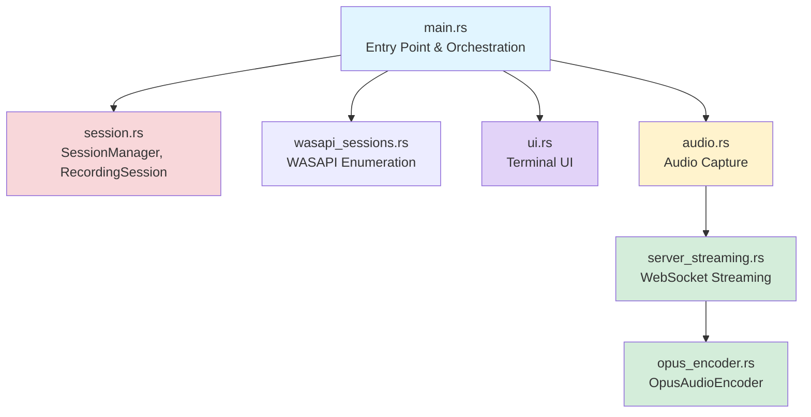
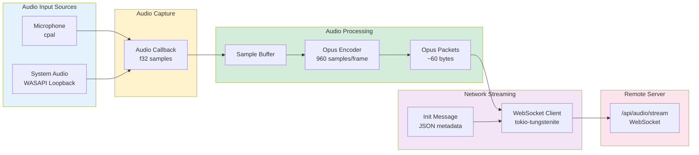
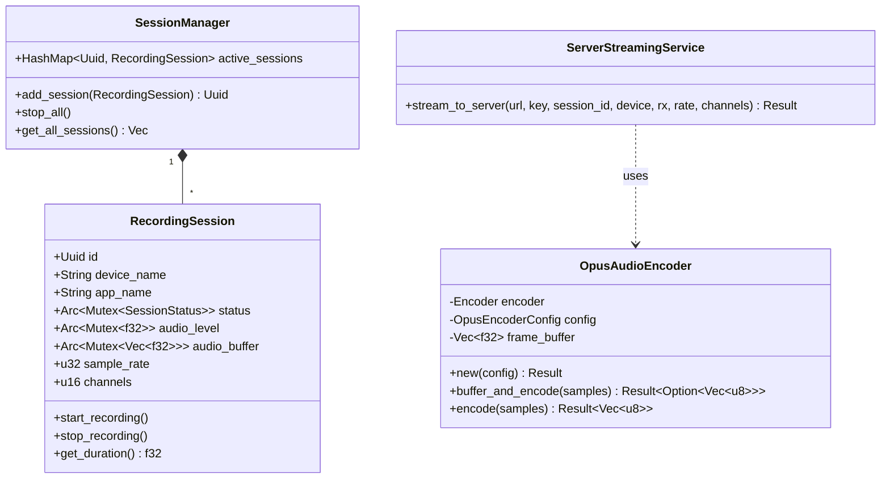
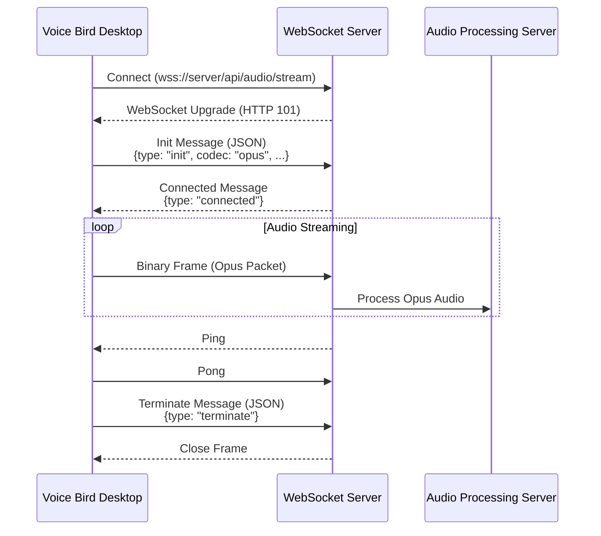
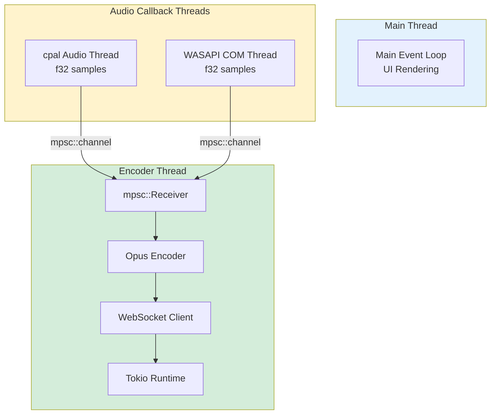
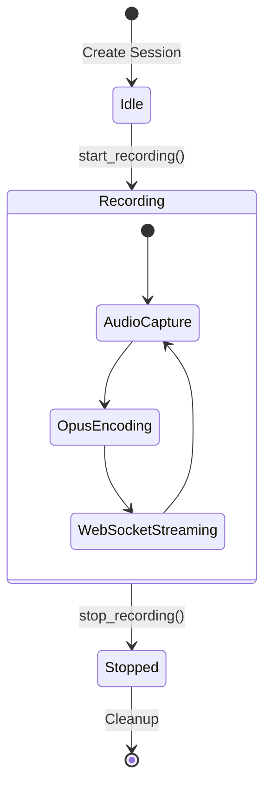

# Voice Bird Desktop - Dependency & Architecture Documentation

> Comprehensive cross-dependency mapping with mermaid diagrams and object descriptions

## Table of Contents

1. [Overview](#overview)
2. [Module Dependency Graph](#module-dependency-graph)
3. [Data Flow Architecture](#data-flow-architecture)
4. [Type & Struct Relationships](#type--struct-relationships)
5. [External Dependencies](#external-dependencies)
6. [Audio Processing Pipeline](#audio-processing-pipeline)
7. [WebSocket Communication Flow](#websocket-communication-flow)
8. [Thread Architecture](#thread-architecture)
9. [Session Lifecycle](#session-lifecycle)
10. [Object Reference](#object-reference)

---

## Overview

**Voice Bird Desktop** is a Rust-based real-time audio recording application for Windows. It captures audio from multiple sources simultaneously (microphones and system audio via WASAPI loopback), encodes it with Opus compression, and streams it to a remote server via WebSocket.

### Key Technologies
- **Language**: Rust (async/sync hybrid)
- **Audio**: cpal (input), WASAPI (output), Opus codec
- **Networking**: WebSocket (tokio-tungstenite)
- **UI**: ratatui (terminal-based)
- **Platform**: Windows-focused (with Linux/macOS input support)

---

## Module Dependency Graph



### Module Descriptions

| Module | Purpose | Key Exports |
|--------|---------|-------------|
| **main.rs** | Application entry point, orchestrates session management and recording lifecycle | `main()`, session initialization |
| **session.rs** | Recording session data structures and state management | `SessionManager`, `RecordingSession`, `AudioSessionInfo`, `SessionStatus` |
| **wasapi_sessions.rs** | Windows WASAPI audio session enumeration using COM APIs | `enumerate_audio_sessions()` |
| **ui.rs** | Terminal UI using ratatui (session browser, recording dashboard) | `App`, `AppMode`, `render_*` functions |
| **audio.rs** | Audio device capture (cpal for input, WASAPI for output loopback) | `start_input_recording()`, `start_output_recording()` |
| **server_streaming.rs** | WebSocket streaming client with Opus encoding | `ServerStreamingService::stream_to_server()` |
| **opus_encoder.rs** | Opus audio codec encoder with buffering | `OpusAudioEncoder` |

---

## Data Flow Architecture



### Data Flow Steps

1. **Audio Capture**: cpal (input devices) or WASAPI (output loopback) captures f32 audio samples at device sample rate
2. **Sample Buffering**: Audio callback thread sends samples via `mpsc::channel` to encoder thread
3. **Opus Encoding**: `OpusAudioEncoder` buffers samples until complete frame (960 samples @ 48kHz = 20ms), then encodes to Opus packet
4. **WebSocket Streaming**: Encoded Opus packets sent as binary WebSocket frames to server
5. **Server Processing**: Server receives Opus audio for transcription or other processing

---

## Type & Struct Relationships



---

## External Dependencies

### Core Dependencies (Cargo.toml)

```toml
[dependencies]
# Audio I/O
cpal = "0.15"              # Cross-platform audio capture
audiopus = "0.3.0-rc.0"    # Opus codec encoder

# Networking
tokio = { version = "1.0", features = ["full"] }
tokio-tungstenite = { version = "0.23", features = ["connect", "native-tls"], default-features = false }
futures-util = "0.3"
http = "1.0"

# Serialization
serde = { version = "1.0", features = ["derive"] }
serde_json = "1.0"
base64 = "0.22"

# UI
ratatui = "0.29"
crossterm = "0.27"
dialoguer = "0.11"
console = "0.15"

# Utilities
anyhow = "1.0"
chrono = "0.4"
uuid = { version = "1.0", features = ["v4"] }
dotenvy = "0.15"
log = "0.4"
env_logger = "0.11"
hound = "3.5"              # WAV file utilities

# Windows-specific
[target.'cfg(windows)'.dependencies]
windows = { version = "0.58", features = [
    "Win32_Media_Audio",
    "Win32_System_Com",
    # ... other features
] }
windows-core = "0.58"
```

---

## Audio Processing Pipeline

### 1. Audio Capture (cpal - Input Devices)

**File**: `src/audio.rs` (Lines 107-245)

```rust
// Callback-based audio capture
device.build_input_stream(
    &config.into(),
    move |data: &[f32], _: &_| {
        // Send to encoder thread
        server_tx.send(data.to_vec());
    },
    |err| log::error!("Stream error: {}", err),
    None,
)?
```

**Key Points**:
- Supports F32, I16, U16 sample formats (converted to f32)
- Real-time audio callback on separate thread
- Non-blocking channel send to avoid audio glitches
- RMS calculation for audio level visualization

### 2. Audio Capture (WASAPI - Output Loopback)

**File**: `src/audio.rs` (Lines 249-437)

```rust
// Windows WASAPI loopback capture
let capture_client: IAudioCaptureClient = audio_client.GetService()?;
audio_client.Start()?;

loop {
    let packet_size = capture_client.GetNextPacketSize()?;
    if packet_size == 0 { break; }

    // Get buffer of f32 samples
    capture_client.GetBuffer(&mut buffer_ptr, ...);
    server_tx.send(samples.to_vec());
    capture_client.ReleaseBuffer(num_frames_available)?;
}
```

**Key Points**:
- Windows-only feature using COM APIs
- Captures system audio (games, music, browser)
- AUDCLNT_STREAMFLAGS_LOOPBACK flag for output capture
- Packet-based buffer processing

### 3. Opus Encoding

**File**: `src/opus_encoder.rs` (Lines 61-222)

```rust
let mut encoder = OpusAudioEncoder::new(OpusEncoderConfig {
    sample_rate: 48000,    // 48 kHz
    channels: 1,           // Mono
    bitrate: 24000,        // 24 kbps
    frame_duration_ms: 20, // 20ms frames
})?;

// Buffer and encode
if let Some(opus_packet) = encoder.buffer_and_encode(&samples)? {
    // Send opus_packet (Vec<u8>) to server
}
```

**Opus Configuration**:
- **Sample Rate**: 48000 Hz (recommended for Opus)
- **Channels**: 1 (mono) or 2 (stereo)
- **Bitrate**: 24000 bps (24 kbps) - optimal for speech
- **Frame Duration**: 20ms (960 samples @ 48kHz)
- **Application Mode**: VOIP (optimized for voice)
- **Complexity**: 5 (medium CPU usage)
- **FEC**: Enabled for packet loss recovery

**Compression Ratio**: ~10-15x (raw f32 audio → Opus)

### 4. WebSocket Streaming

**File**: `src/server_streaming.rs` (Lines 57-403)

```rust
// Connect to WebSocket
let ws_stream = connect_async_with_config(
    "wss://server.com/api/audio/stream",
    ws_config,
    false
).await?;

// Send init message (JSON)
let init_msg = InitMessage {
    message_type: "init",
    api_key,
    session_id,
    device_name,
    sample_rate,
    channels,
    codec: "opus",
};
write.send(Message::Text(init_json)).await?;

// Stream Opus packets (binary)
write.send(Message::Binary(opus_packet)).await?;
```

**WebSocket Protocol**:
1. **Connection**: wss:// endpoint with Authorization header
2. **Init Message**: JSON with session metadata and codec="opus"
3. **Audio Streaming**: Binary frames containing Opus packets
4. **Keepalive**: Ping/Pong for connection maintenance
5. **Termination**: JSON terminate message when done

---

## WebSocket Communication Flow



### Message Types

**Client → Server**:
- `init` (JSON): Session metadata (sample_rate, channels, codec, session_id, device_name)
- Binary frames: Opus-encoded audio packets
- `terminate` (JSON): End of stream notification
- `pong`: Response to server pings

**Server → Client**:
- `connected` (JSON): Acknowledgment of init
- `error` (JSON): Error notifications
- `ping`: Keepalive checks

---

## Thread Architecture



### Thread Descriptions

1. **Main Thread**:
   - UI rendering with ratatui
   - Keyboard input handling
   - Session management coordination

2. **Audio Callback Threads** (per device):
   - cpal: Separate thread per audio stream
   - WASAPI: Custom thread for COM operations
   - Real-time priority for low latency
   - Send samples to encoder via `mpsc::channel`

3. **Encoder Thread** (per session):
   - Receives f32 samples from audio threads
   - Buffers samples to complete Opus frames
   - Encodes to Opus packets
   - Streams via WebSocket to server
   - Runs on Tokio async runtime

### Synchronization Primitives

- `Arc<Mutex<T>>`: Shared state (audio_level, audio_buffer, status, stop_signal)
- `mpsc::channel`: Audio samples from callback → encoder thread
- `tokio_mpsc::unbounded_channel`: Pong messages from read task → write loop
- `stop_signal`: Graceful shutdown coordination

---

## Session Lifecycle



### Session States

- **Idle**: Session created but not recording
- **Recording**: Active audio capture and streaming
- **Stopped**: Recording ended, cleanup in progress

### Session Operations

1. **Creation** (`RecordingSession::new`)
   - Generate UUID
   - Initialize Arc<Mutex> shared state
   - Set sample rate and channels

2. **Start Recording** (`start_recording`)
   - Set status to Recording
   - Start timestamp
   - Begin audio capture stream
   - Spawn encoder thread with WebSocket streaming

3. **Stop Recording** (`stop_recording`)
   - Set status to Stopped
   - Set stop_signal flag
   - Audio threads check flag and exit
   - WebSocket sends terminate message

---

## Object Reference

### RecordingSession

**Location**: `src/session.rs` (Lines 23-94)

**Purpose**: Represents a single audio recording session from one device

**Fields**:
- `id: Uuid` - Unique session identifier
- `device_name: String` - Audio device name
- `app_name: String` - Application associated with audio session
- `status: Arc<Mutex<SessionStatus>>` - Current recording state
- `audio_level: Arc<Mutex<f32>>` - Real-time RMS audio level (0.0-1.0)
- `audio_buffer: Arc<Mutex<Vec<f32>>>` - Accumulated audio samples
- `sample_rate: u32` - Audio sample rate (e.g., 48000 Hz)
- `channels: u16` - Number of audio channels (1=mono, 2=stereo)
- `start_time: Option<Instant>` - Recording start timestamp
- `stop_signal: Arc<Mutex<bool>>` - Flag to stop audio capture

### OpusAudioEncoder

**Location**: `src/opus_encoder.rs` (Lines 61-222)

**Purpose**: Opus codec encoder with automatic frame buffering

**Key Methods**:
- `new(config: OpusEncoderConfig) -> Result<Self>`
- `buffer_and_encode(&mut self, samples: &[f32]) -> Result<Option<Vec<u8>>>`
  - Buffers samples until complete frame
  - Returns Some(opus_packet) when frame ready
- `encode(&mut self, samples: &[f32]) -> Result<Vec<u8>>`
  - Direct encoding (requires exact frame size)

### ServerStreamingService

**Location**: `src/server_streaming.rs` (Lines 44-404)

**Purpose**: WebSocket client for streaming Opus audio to server

**Key Method**:
```rust
async fn stream_to_server(
    server_url: String,
    api_key: String,
    session_id: String,
    device_name: String,
    audio_rx: mpsc::Receiver<Vec<f32>>,
    sample_rate: u32,
    channels: u16,
) -> Result<()>
```

**Features**:
- Automatic WebSocket connection with retry
- Opus encoding integration
- Ping/Pong keepalive
- Binary frame streaming
- Compression disabled (matching server config)

---

## Performance Characteristics

### Latency Profile

- **Audio Capture**: <10ms (hardware buffer + callback)
- **Opus Encoding**: 20ms (frame duration)
- **WebSocket Send**: ~10ms (network + serialization)
- **End-to-End**: ~40-50ms (capture to server receive)

### Bandwidth Usage

**Raw Audio** (48kHz mono f32):
- 48000 samples/sec × 4 bytes/sample = 192 KB/s

**Opus Compressed** (24 kbps):
- 24000 bits/sec = 3 KB/s
- **Compression**: ~64x reduction

**Network Traffic**:
- ~3 KB/s per audio session
- WebSocket overhead: <100 bytes/packet
- Keepalive pings: ~50 bytes every 30s

### CPU Usage

- **Audio Capture**: <1% (hardware DMA)
- **Opus Encoding**: ~2-5% per session (complexity=5)
- **WebSocket**: <1% (async I/O)
- **UI Rendering**: <1% (terminal updates)

**Total**: ~5-10% CPU for single session on modern processor

---

## Environment Configuration

**File**: `.env`

```bash
# WebSocket server endpoint (required)
VOICE_BIRD_SERVER_URL=https://voice-bird-app.example.com

# API key for authentication (required)
VOICE_BIRD_API_KEY=your-api-key-here
```

---

## Build & Deployment

### Build Artifacts

- **Binary Size**: ~4-6 MB (release build with optimizations)
- **Dependencies**: Static linking (no runtime dependencies besides OS libraries)
- **Platform**: Windows x64 (primary), Linux x64 (input only), macOS (input only)

### Release Build

```bash
cargo build --release
# Binary: target/release/voice_bird_desktop.exe
```

### Optimization Flags (Cargo.toml)

```toml
[profile.release]
opt-level = 3          # Maximum optimization
lto = true             # Link-time optimization
codegen-units = 1      # Better optimization
strip = true           # Remove debug symbols
```

---

## Future Enhancements

- [ ] HTTP/2 streaming as alternative to WebSocket
- [ ] Adaptive bitrate based on network conditions
- [ ] Multiple codec support (Opus, AAC, MP3)
- [ ] Linux/macOS output loopback (PulseAudio, CoreAudio)
- [ ] Persistent session resumption
- [ ] Audio filters (noise reduction, AGC)
- [ ] Multi-track recording UI
