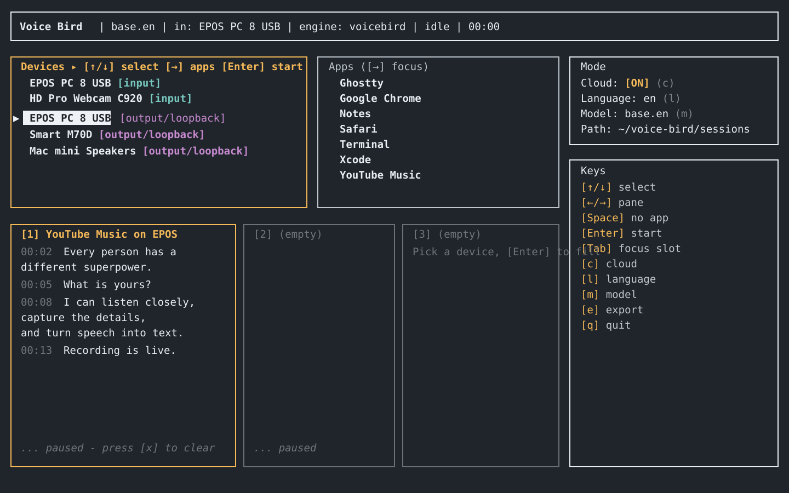

# Voice Bird CLI

Voice Bird CLI is a terminal voice transcription app. It runs **locally by default** with Whisper models, so local recordings stay on your machine. When you want hosted transcription, you can opt in per source to VoiceBird Web cloud mode.



## Basic Flow

1. Pick a microphone, system-output loopback device, or app audio source.
2. Choose local or cloud mode for that source.
3. Press `Enter` to start a transcription slot.
4. Watch committed and tentative transcript text stream into the TUI.
5. In local mode, review session files under `~/voice-bird/sessions/<timestamp>-<source>/`.

Local sessions contain:

| File | Content |
| --- | --- |
| `audio.wav` | 16 kHz mono recording |
| `transcript.jsonl` | Append-only transcript log, useful after crashes |
| `transcript.json` | Finalized transcript segments and metadata |
| `transcript.txt` | Plain-text transcript |
| `meta.json` | Device, source, model, engine, and duration |

## Getting Started

Install one of the CLI packages, then run:

```bash
voice-bird-cli
```

On first launch, Voice Bird picks a local Whisper model and downloads it into your OS cache directory. The default model is `distil-small.en`. Settings are stored in `~/.config/voice-bird/config.toml` on Linux/macOS and `%APPDATA%\voice-bird\config.toml` on Windows.

Press `m` to change models. The picker includes `nemotron-3.5-asr-streaming-0.6b`, NVIDIA's latest Nemotron 3.5 ASR streaming model via the local `parakeet-rs` engine. Select it, let the package download/unpack, then start recording; the engine label and `meta.json` should show `nemotron`.

macOS users may need to grant Screen Recording permission for system or app audio capture. Apple Silicon users can optionally build the WhisperKit sidecar for ANE-accelerated local inference:

```bash
cargo run -p xtask -- build-sidecar
```

Without the sidecar, Voice Bird falls back to `whisper-rs` with whisper.cpp.

## Install

Cargo installs the native Rust binary directly:

```bash
cargo install voice-bird-cli
```

PyPI installs a small wrapper that installs/runs the Cargo binary:

```bash
pipx install voice-bird-cli
# or
pip install voice-bird-cli
```

npm installs a small wrapper that installs/runs the Cargo binary:

```bash
npm install -g voice-bird-cli
```

From source:

```bash
git clone https://github.com/voice-bird/voice-bird-cli.git
cd voice-bird-cli
cargo install --path .
```

The npm and PyPI packages require Rust Cargo on the machine. Use the Cargo or source install when you want the simplest path.

## Local And Cloud Modes

**Free local mode** is the default. It uses local Whisper inference through `whisper-rs`, or WhisperKit on macOS when the sidecar is available. Local mode does not send audio to a server and writes session artifacts to disk. Current local models are English-focused in the app flow.

**Cloud mode** streams audio to VoiceBird Web at `wss://voicebird.app/api/audio/stream`. It is opt-in, requires a Voice Bird API key, and is useful when local hardware cannot keep up or when you want cloud language support. Cloud recordings live in your VoiceBird Web account instead of the local sessions folder.

Your Voice Bird API key is stored in plaintext in `config.toml`; on Unix the app sets the file to `0600` best-effort.

## Usage

```bash
voice-bird-cli                         # start the TUI
voice-bird-cli --recover <session-dir> # rebuild transcript.{json,txt} after a crash
```

## Keys

| Key | Action |
| --- | --- |
| `↑` / `↓` | Select device or app |
| `←` / `→` | Move between panes |
| `Enter` | Start the selected source |
| `Space` | Clear selected app pairing |
| `Tab` | Move between transcript slots |
| `r` | Refresh devices and apps |
| `c` | Toggle cloud mode for the focused source |
| `l` | Change language for cloud mode |
| `m` | Change model |
| `e` | Export the latest local transcript |
| `p` | Change local session path |
| `x` | Clear stopped transcript slot |
| `q` | Quit |
| `?` | Help |

## License

MIT
